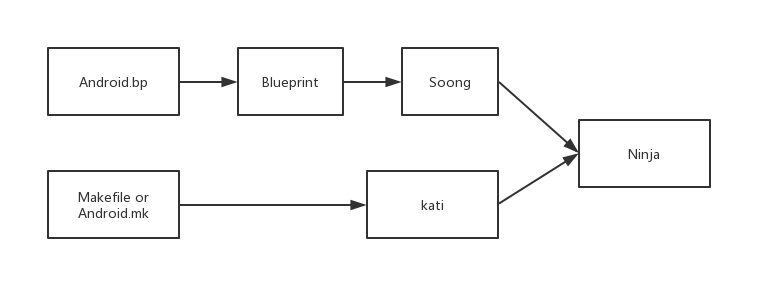

# AOSP 相关概念及目录结构

## 一、编译工具

**Makefile** ：

Android平台的编译系统，其实就是用 Makefile 写出来的一个独立项目。它定义了编译的规则，实现了“自动化编译”，不仅把分散在数百个Git库中的代码整合起来、统一编译， 而且还把产物分门别类地输出到一个目录，打包成手机ROM，还可以生成应用开发时所使用的SDK、NDK等。

因此，采用 Makefile 编写的编译系统，也可以称为 Makefile 编译系统。

**Android.mk**：

Makefile 编译系统的一部分，定义了一个模块的必要参数，使模块随着平台编译。通俗来讲就是告诉编译系统，以什么样的规则编译你的源代码，并生成对应的目标文件。

**kati**：

kati 是谷歌专门为了 Android 而开发的一个小项目，基于 Golang 和 C++。 目的是把 Android 中的 Makefile，转换成 Ninja 文件。

**Ninja**：

Ninja 是一个致力于速度的小型编译系统，如果把其他的编译系统看作高级语言，那么 Ninja 目标就是汇编。

**Android.bp**：

Android.bp，是用来替换 Android.mk 的配置文件。

**Soong**：

Soong 是谷歌用来替代此前的 Makefile 编译系统的替代品，负责解析 Android.bp 文件，并将之转换为 Ninja 文件。

**Blueprint**：

Blueprint 用来解析 Android.bp 文件翻译成 Ninja 语法文件。

Android.mk、Ninja、Soong、Blueprint、kati、Android.bp的概念之间的联系为：



Blueprint 负责解析 Android.bp 文件内容，Blueprint 类似一个处理相关语法的库文件，Soong 则是定义具体如何处理相应的语法以及命令实现。通俗来讲就是 Soong 借助于 Blueprint 定义的 Android.bp 语法，完成 Android.bp 的解析，最终转换成 Ninja 文件。

Makefile 文件会通过 kati 转换为 Ninja 文件。

随着 Android 工程越来越大，采用 Makefile 的编译系统花费的时间也越来越长，因此谷歌在 Android 7.0 开始引入了 Ninja 来编译系统，相对于 Makefile 来说 Ninja 在大的项目管理中速度和并行方面有突出的优势。

Makefile 默认文件名为 Makefile 或 makefile，也常用 .make 或 .mk 作为文件后缀。 Ninja 的默认文件名是 build.ninja，其它文件以 .ninja 为后缀。Makefile 与 Ninja 的区别在于, Makefile 是设计来给开发编写的，而 Ninja 设计出来是给其它程序生成的。如果 Makefile 是 Java 语言，那么 Ninja 就是汇编语言。

## 二、编译环境

在源码目录下执行：

```cmd
source build/envsetup.sh
lunch
```

会输出：

```cmd
...
Lunch menu... pick a combo:
     1. aosp_arm-eng
     2. aosp_arm64-eng
     3. aosp_mips-eng
     4. aosp_mips64-eng
     5. aosp_x86-eng
     6. aosp_x86_64-eng
     7. aosp_car_arm-userdebug
  ...
```

意思就是要你选择编译目标的格式，编译目标的格式组成为 BUILD-BUILDTYPE，比如 aosp_arm-eng 的 BUILD 为 aosp_arm，BUILDTYPE 为 eng。

其中 BUILD 表示编译出的镜像可以运行在什么环境，aosp 代表 Android 开源项目，arm 表示系统是运行在 arm 架构的处理器上。

BUILDTYPE 指的是编译类型，有以下三种：

- user：用来正式发布到市场的版本，权限受限，如没有 root 权限，不能 dedug，adb 默认处于停用状态。
- userdebug：在 user 版本的基础上开放了 root 权限和 debug 权限，adb 默认处于启用状态。一般用于调试真机。
- eng：开发工程师的版本，拥有最大的权限(root等)，具有额外调试工具的开发配置。一般用于模拟器。

如果你没有 Nexus 设备，只想编译完后运行在模拟器查看，那么BUILD可以选择aosp_x86_64，BUILDTYPE 选择 eng。

编译成功后会在 out/target/product/generic_x86_64/ 目录生成了三个重要的镜像文件： system.img、userdata.img、ramdisk.img。

- system.img：系统镜像，里面包含了Android系统主要的目录和文件，通过 init.c 进行解析并 mount 挂载到 /system 目录下。
- userdata.img：用户镜像，是 Android 系统中存放用户数据的，通过 init.c 进行解析并 mount 挂载到 /data 目录下。
- ramdisk.img：根文件系统镜像，包含一些启动Android系统的重要文件，比如init.rc。

## 三、目录结构

art：Android Runtime，一种App运行模式，区别于传统的Dalvik虚拟机，旨在提高Android系统的流畅性

bionic：基础C库源代码，Android改造的C/C++库

bootable：Android程序启动导引，适合各种bootloader的通用代码，包括一个recovery目录

build：存放系统编译规则及generic等基础开发包配置

cts： Android兼容性测试套件标准

dalvik：Android Dalvik虚拟机相关内容

developers：Android开发者参考文档。通常用于存储一些面向 Android 开发者的资源和文档，以帮助他们更好地了解 Android 平台的开发流程、最佳实践和技术细节。 

development： Android应用开发基础设施相关。包含了与 Android 应用程序开发相关的工具、示例代码和测试套件。这些工具和资源可以帮助开发者编写、调试和测试 Android 应用程序。

device：Android支持的各种设备及相关配置。含了各个设备制造商提供的特定设备的配置文件和驱动程序。每个设备制造商的目录下通常包含了该厂商的设备列表，然后在每个设备目录下包含了该设备的配置和驱动等信息。

external：Android中使用的外部开源库。包含了一些不属于核心 Android 框架但是被 Android 系统所使用的外部库和工具。例如，WebKit 渲染引擎、SQLite 数据库、OpenSSL 加密库等。

frameworks：应用程序框架，Android系统核心部分，由Java和C++编写，例如 Activity Manager、Window Manager、Telephony 等等。Android 框架层是构建在 Android 操作系统之上的一层抽象，它为应用程序提供了访问设备硬件、管理应用程序生命周期、处理用户界面、执行系统服务等功能。

hardware：硬件适配接口。包含了 Android 系统中硬件抽象层（Hardware Abstraction Layer，简称 HAL）的实现。HAL 是一个抽象层，用于将 Android 系统与底层硬件之间进行解耦，使得 Android 系统可以在不同硬件架构和设备上运行而无需修改其源代码。

kernel：Linux Kernel，不过Android默认不提供，需要单独下载，只有一个tests目。包含了许多由 Google 和设备制造商添加的补丁和驱动程序。

libcore：Android Java核心类库

libnativehelper：Android动态库，实现JNI库的基础

packages：包含了各种 Android 应用程序的源代码，例如系统应用程序（如浏览器、音乐播放器、设置等）和一些示例应用程序（如备忘录、日历等），这些应用程序涵盖了从系统级应用到用户界面应用的各种功能。

pdk：Plug Development Kit 的缩写，本地开发套件

platform_testing：Android平台测试程序

prebuilts：x86和arm架构下预编译的一些资源

sdk：Android的Java层sdk

system：Android底层文件系统库、应用和组件。它包含了 Android 系统的核心代码、服务和库。这些代码负责管理设备的各种系统级功能，提供应用程序所需的各种服务和资源，其中包括 Zygote 进程、Binder IPC（Inter-Process Communication）机制、Dalvik 虚拟机、一些标准的系统服务等。

test：Android Vendor测试框架

toolchain：Android工具链文件

tools：Android工具文件

vendor： 目录包含了一些设备制造商和供应商提供的专有库、驱动程序等。这些文件通常与特定设备的硬件相关，并且可能包含一些商业机密信息，因此这些文件通常不包含在 AOSP 的公共版本中，而是由设备制造商单独提供。

### 3.1 build 目录详解

blueprint 输入为.bp文件。输出为.ninja文件

core	Android 系统的核心构建系统。它包括了构建 Android 源代码所需的所有脚本和配置文件，例如 build/core/ 目录中的 Makefile 和 Shell 脚本。

kati	kati is an experimental GNU make clone

make	以前的老的make系统

soong	新的Build系统

target	AOSP自带的Target(模拟器)的一些makefile。Android 系统的目标设备配置文件。每个目标设备都有一个相应的配置文件，用于指定编译系统时所需的设备特定配置，例如硬件支持、启动参数等。

tools	编译中使用的shell及python写的工具脚本。包含了用于构建 Android 系统的各种工具和实用程序。这些工具包括了编译器、链接器、打包工具、签名工具等，用于将源代码编译成可执行的系统镜像。

build/envsetup.sh	编译初始化脚本。用于设置环境变量和配置项，以便在构建 Android 系统时正确设置编译环境。

### 3.2 frameworks 目录详解

framework/av/ 多媒体相关的native层源码目录

framework/base/ 一些基础库代码，各种解析类、工具类都在这个里面。这个目录包含了 Android 框架层的核心代码。它定义了 Android 平台的基本功能，例如应用程序管理、进程管理、权限管理、资源管理等。这些功能对整个系统都是必不可少的。

framework/compile/ 编译相关的内容

framework/ex/ ex文件解析器

framework/minikin/ Android原生字体

framework/ml/ 机器学习

framework/multidex/ multi dex Loader

framework/native/ power、surface、input、binder等服务的native层实现源码目录。包含了一些使用 C/C++ 编写的本地代码库。这些库用于提供一些高性能的系统功能，例如图形渲染、音频处理等。其中包括了 Skia 图形库、OpenGL ES 图形库、OpenSL ES 音频库等。

framework/opt/ 一些基础软件，如：日历、网络、蓝牙

framework/rs/ Render Script 可创建3D接口

framework/wilhelm/ OpenSL ES/OpenMAX AL的audio

#### 3.2.1 子目录

telephony/：这个目录包含了与电话和移动通信相关的代码。它包括了电话服务、短信服务、数据连接服务等。这些代码用于与移动网络进行通信，管理手机呼叫和消息。

wifi/：包含了与 Wi-Fi 网络相关的代码。它包括了 Wi-Fi 硬件的驱动程序、Wi-Fi 网络连接管理器、Wi-Fi P2P（点对点）连接管理器等。

media/： 这个目录包含了与多媒体处理相关的代码。它包括了音频播放器、视频播放器、摄像头管理器、媒体编解码器等。这些代码用于管理设备上的多媒体硬件，并提供多媒体数据的处理和播放功能。

graphics/： 包含了与图形处理相关的代码。它包括了图形渲染引擎、2D/3D 图形库、图形驱动程序等。这些代码用于处理应用程序界面的绘制和图形效果的渲染。

location/： 包含了与位置服务相关的代码。它包括了位置管理器、GPS 定位服务、地理围栏服务等。这些代码用于获取设备的地理位置信息，并提供位置相关的服务和功能。

view/： 这个目录包含了与用户界面相关的代码。它包括了视图管理器、布局管理器、触摸事件处理器等。这些代码用于管理应用程序的用户界面，并处理用户输入事件。

content/： 包含了与内容提供者相关的代码。内容提供者是 Android 平台中用于共享和访问数据的组件。这些代码用于定义内容提供者的接口和实现，以及管理数据的访问权限。

webview/： 包含了 WebView 组件的代码。WebView 是一个用于在应用程序中显示 Web 内容的组件，它基于浏览器引擎来加载和渲染网页。

### 3.3 packages 目录详解

apps/： 这个目录包含了 Android 操作系统中的一些系统级应用程序。这些应用程序通常是与设备硬件紧密相关的，例如电话、短信、联系人、日历等。

providers/： 包含了内容提供者相关的应用程序。内容提供者是 Android 平台中用于共享和访问数据的组件，这些应用程序通常用于管理数据的存储和访问权限。

wallpapers/： 这个目录包含了 Android 平台中的壁纸应用程序。壁纸应用程序允许用户设置桌面背景图片和动态壁纸。

inputmethods/： 包含了输入法应用程序的代码。输入法应用程序允许用户选择并使用不同的键盘布局和输入方式。

browser/： 包含了 Android 平台中的浏览器应用程序。这些应用程序用于浏览互联网上的网页内容。

contacts/： 包含了联系人应用程序的代码。联系人应用程序用于管理设备上存储的联系人信息，例如姓名、电话号码、电子邮件地址等。

calendar/： 包含了日历应用程序的代码。日历应用程序用于管理用户的日程安排和事件提醒。

settings/： 这个目录包含了 Android 平台中的设置应用程序。设置应用程序允许用户配置设备的各种参数和选项，例如网络连接、声音设置、安全选项等。

emergency/： 包含了紧急信息应用程序的代码。紧急信息应用程序允许用户在紧急情况下访问紧急联系人和医疗信息。

soundrecorder/： 包含了录音应用程序的代码。录音应用程序允许用户录制音频片段，并保存到设备上的文件中。

### 3.4 kernel 目录详解

arch/： 这个目录包含了各种架构的特定代码，例如 ARM、ARM64、x86 等。每个架构都有自己的子目录，包含了针对该架构的内核代码。

block/： 包含了块设备子系统的代码，用于管理存储设备（如磁盘）上的数据块。

crypto/： 这个目录包含了加密相关的代码，用于提供数据加密和解密功能。

drivers/： 这个目录包含了各种硬件设备的驱动程序。每个设备类型都有自己的子目录，其中包含了该设备类型的驱动代码。

fs/： 包含了文件系统相关的代码，例如 ext4、FAT32 等文件系统的实现。

include/： 这个目录包含了内核的头文件，供内核源代码中的其他部分使用。

init/： 包含了内核启动过程中的初始化代码，包括初始化内核参数和子系统。

mm/： 包含了内存管理子系统的代码，用于管理系统的内存分配和释放。

net/： 包含了网络子系统的代码，用于实现网络协议栈和网络设备驱动程序。

security/： 包含了安全子系统的代码，用于实现安全相关功能，例如访问控制、安全模块等。

sound/： 包含了音频子系统的代码，用于管理音频设备和处理音频数据。

virt/： 这个目录包含了虚拟化相关的代码，用于支持在虚拟机环境中运行 Android。

kernel/： 这是 Android 特定的目录，包含了 Android 平台特定的内核代码和补丁。

### 3.5 device 目录详解

[manufacturer]/： 在这个目录下，通常有子目录对应于每个设备制造商的名称，例如 samsung/、google/、htc/等。每个制造商的子目录包含了该制造商所生产的各种设备的配置。

[manufacturer]/[device]/： 这个目录下包含了特定设备的配置文件和驱动程序。每个设备的子目录中通常包含了该设备的硬件配置文件、设备树（Device Tree）、设备相关的启动脚本、特定于该设备的驱动程序等。

[manufacturer]/[device]/configs/： 这个目录包含了设备的配置文件。这些文件包括了编译 Android 系统时所需的设备特定配置，例如设备的硬件功能、启动参数等。

[manufacturer]/[device]/proprietary/： 这个目录通常包含了一些设备制造商提供的专有库和驱动程序。这些文件通常与设备的硬件相关，并且可能包含一些商业机密信息，因此这些文件通常不包含在 AOSP 的公共版本中，而是由设备制造商单独提供。

[manufacturer]/[device]/overlay/： 这个目录包含了设备的资源覆盖文件。这些文件可以用于修改或扩展 Android 系统的默认资源，例如修改系统界面的颜色、图标、字体等。

[manufacturer]/[device]/kernel/： 这个目录通常包含了特定设备的内核源代码或内核模块。某些设备制造商可能会提供自定义的内核源代码，用于支持设备的特定硬件功能或增强性能。

### 3.6 vendor 目录详解

[manufacturer]/： 这个目录通常包含了每个设备制造商的专有文件和配置。每个制造商的子目录可能包含了该制造商生产的所有设备的共享文件，或者可能有针对每个设备的子目录。

[manufacturer]/[device]/： 这个目录包含了特定设备的供应商专有文件和配置。它可能包含了设备特定的驱动程序、硬件相关的配置文件、启动脚本等。

[manufacturer]/[device]/proprietary/： 这个目录通常包含了一些设备制造商提供的专有库和驱动程序。这些文件用于支持设备的特定硬件功能，例如摄像头驱动程序、传感器驱动程序等。

[manufacturer]/[device]/config/： 这个目录包含了特定设备的配置文件。这些文件包括了编译 Android 系统时所需的设备特定配置，例如设备的硬件功能、启动参数等。

[manufacturer]/[device]/overlay/： 这个目录包含了设备的资源覆盖文件。这些文件可以用于修改或扩展 Android 系统的默认资源，例如修改系统界面的颜色、图标、字体等。

[manufacturer]/[device]/kernel/： 这个目录通常包含了特定设备的内核源代码或内核模块。某些设备制造商可能会提供自定义的内核源代码，用于支持设备的特定硬件功能或增强性能。

### 3.7 system 目录详解

core/： 这个目录包含了 Android 系统的核心库和服务。其中包括了一些关键的系统服务和框架类，例如 Activity Manager、Window Manager、PackageManager、System Server 等。这些组件负责管理应用程序的生命周期、处理用户界面、管理应用程序的安装和卸载等。

lib/： 这个目录包含了系统级的动态链接库（.so 文件）。这些库文件提供了系统级的功能和服务，例如图形渲染、文件系统操作、网络通信等。其中包括了一些常用的系统库，例如 libc、libm、libz 等。

bin/： 这个目录包含了一些系统级的可执行文件。这些文件包括了一些用于系统管理、调试和测试的命令行工具，例如 logcat、dumpsys、pm 等。

media/： 这个目录包含了与多媒体处理相关的代码和库。其中包括了音频播放器、视频播放器、摄像头管理器、媒体编解码器等。这些组件用于管理设备上的多媒体硬件，并提供多媒体数据的处理和播放功能。

net/： 这个目录包含了与网络通信相关的代码和库。其中包括了网络协议栈、套接字库、网络连接管理器等。这些组件用于实现设备与网络之间的通信，支持各种网络协议和连接方式。

power/： 这个目录包含了与电源管理相关的代码和库。其中包括了电池管理器、电源管理器、休眠管理器等。这些组件用于管理设备的电源状态，优化电池使用和延长设备的待机时间。

security/： 这个目录包含了与系统安全相关的代码和库。其中包括了访问控制、加密、安全模块等功能的实现。这些组件用于保护系统和用户数据的安全性。

ui/： 这个目录包含了与用户界面相关的代码和库。其中包括了视图管理器、布局管理器、触摸事件处理器等。这些组件用于管理应用程序的用户界面，并处理用户输入事件。

bluetooth/： 这个目录包含了与蓝牙通信相关的代码和库。其中包括了蓝牙协议栈、蓝牙连接管理器等。这些组件用于实现设备与蓝牙设备之间的通信。

### 3.8 external 目录详解

apache-harmony/： 这个目录包含了 Apache Harmony 项目的代码。Apache Harmony 是一个开源的 Java SE 实现，Android 中的 Dalvik 虚拟机就是基于 Apache Harmony 开发的。

curl/： 这个目录包含了 libcurl 库的代码。libcurl 是一个用于传输数据的开源客户端 URL 传输库，它支持各种协议，例如 HTTP、HTTPS、FTP 等。

icu4c/： 这个目录包含了 ICU（International Components for Unicode）库的代码。ICU 是一个开源的 Unicode 和国际化支持库，它提供了一系列用于处理文本、格式化日期时间、转换字符编码等功能的 API。

sqlite/： 这个目录包含了 SQLite 数据库引擎的代码。SQLite 是一个轻量级的、嵌入式的 SQL 数据库引擎，广泛用于 Android 系统中的数据存储和管理。

openssl/： 这个目录包含了 OpenSSL 加密库的代码。OpenSSL 提供了各种加密和安全功能的 API，包括 SSL/TLS 协议的实现、密码学算法的支持等。

libavc/： 这个目录包含了 AVC（Advanced Video Coding）视频编解码器的代码。AVC 是一种广泛使用的视频编码标准，也称为 H.264。

v8/： 这个目录包含了 V8 JavaScript 引擎的代码。V8 是由 Google 开发的高性能 JavaScript 引擎，用于在 Android 系统中执行 JavaScript 代码。

wpa_supplicant/： 这个目录包含了 wpa_supplicant Wi-Fi 客户端的代码。wpa_supplicant 是一个用于连接 Wi-Fi 网络的开源软件，它实现了 Wi-Fi 相关的协议和功能。

webkit/： 这个目录包含了 WebKit 渲染引擎的代码。WebKit 是一个开源的网页渲染引擎，它用于在 Android 系统中显示 Web 内容，例如在浏览器应用中。

nss/： 这个目录包含了 Network Security Services（NSS）库的代码。NSS 是一个开源的加密库，提供了 SSL/TLS 协议的实现、数字证书管理等功能。

### 3.9 hardware 目录详解

audio/： 这个目录包含了音频硬件抽象层的实现。它定义了与音频相关的接口和功能，包括音频输入输出、音频路由、音频效果等。

camera/： 这个目录包含了相机硬件抽象层的实现。它定义了与相机相关的接口和功能，包括相机预览、拍照、视频录制等。

bluetooth/： 这个目录包含了蓝牙硬件抽象层的实现。它定义了与蓝牙设备通信相关的接口和功能，包括蓝牙配对、蓝牙数据传输等。

wifi/： 这个目录包含了 Wi-Fi 硬件抽象层的实现。它定义了与 Wi-Fi 设备通信相关的接口和功能，包括 Wi-Fi 连接、Wi-Fi 数据传输等。

gps/： 这个目录包含了 GPS 硬件抽象层的实现。它定义了与 GPS 定位设备通信相关的接口和功能，包括获取位置信息、定位服务等。

lights/： 这个目录包含了设备指示灯硬件抽象层的实现。它定义了与设备指示灯（如通知指示灯、键盘背光等）相关的接口和功能。

sensors/： 这个目录包含了传感器硬件抽象层的实现。它定义了与设备上的各种传感器（如加速度计、陀螺仪、磁力计等）通信相关的接口和功能。

radio/： 这个目录包含了无线电硬件抽象层的实现。它定义了与无线电设备（如调制解调器、基带处理器等）通信相关的接口和功能。

graphics/： 这个目录包含了图形硬件抽象层的实现。它定义了与图形渲染、图形加速等功能相关的接口和功能。

### 3.10 u-boot 目录详解

u-boot/: 目录是一个开源的引导加载程序（bootloader），用于引导 Android 系统。u-boot 负责初始化硬件设备、加载 Linux 内核和文件系统，并将控制权转交给 Linux 内核。

以下是该目录结构的详细说明：

    arch/： 这个目录包含了与处理器架构相关的代码。不同的处理器架构（如 ARM、ARM64）可能会有不同的实现，因此这个目录包含了针对特定处理器架构的配置和代码。

    board/： 这个目录包含了与硬件板级支持相关的代码。每个支持的硬件板都有一个相应的子目录，其中包含了该硬件板的配置文件、初始化代码和驱动程序。

    cmd/： 这个目录包含了 u-boot 的命令行工具。其中的每个文件都定义了一个或多个 u-boot 命令，用于执行各种操作，例如启动系统、加载文件、配置硬件等。

    configs/： 这个目录包含了不同硬件配置的配置文件。每个配置文件定义了特定硬件平台的编译选项和配置参数，以便生成适用于该硬件平台的 u-boot 镜像。

    disk/： 这个目录包含了用于生成磁盘映像的工具和脚本。这些工具可以将编译生成的 u-boot 镜像写入到存储介质（如 SD 卡、EMMC 等）中，并将其用作启动介质。

    drivers/： 这个目录包含了与设备驱动程序相关的代码。其中包括了各种设备的驱动程序，例如存储设备驱动、网络设备驱动、串口驱动等。

    env/： 这个目录包含了环境变量相关的代码和配置文件。u-boot 可以存储一些配置信息和参数到环境变量中，以便在系统启动时使用。

    include/： 这个目录包含了 u-boot 的头文件。其中的头文件定义了各种数据结构、宏定义和函数声明，供 u-boot 的源代码和驱动程序使用。

    net/： 这个目录包含了网络相关的代码。其中包括了网络协议栈、网络设备驱动等，用于支持 u-boot 在网络环境下的启动和通信。

    scripts/： 这个目录包含了用于构建和配置 u-boot 的脚本文件。其中包括了编译 u-boot 的 Makefile、配置脚本等。

    spl/： 这个目录包含了 Secondary Program Loader（SPL）的实现。SPL 是一个用于引导加载更大的启动程序的小型启动程序，它通常用于引导加载 u-boot。

    test/： 这个目录包含了用于测试 u-boot 的测试代码和工具。

    tools/： 这个目录包含了用于开发和调试 u-boot 的工具。其中包括了调试器、磁盘映像生成工具等。

    common/： 这个目录包含了一些通用的代码和配置文件，可以被不同的硬件平台共享使用。

这些是 bootable/bootloader/uboot-imx/ 目录中的一些主要子目录及其功能。这些目录包含了 u-boot 的源代码、配置文件和工具，用于构建、配置和定制 u-boot 引导加载程序。

存储位置： 在 AOSP 中，u-boot 通常存储在 bootable/bootloader/uboot-imx/ 目录下，其中 uboot-imx 是适用于 i.MX 系列处理器的 u-boot 版本。不同的处理器架构可能有不同的 u-boot 实现。

功能： u-boot 主要负责以下几个方面的功能：
    初始化系统硬件，包括处理器、内存、存储设备、串口等。
    加载 Linux 内核和设备树（Device Tree）文件。
    设置 Linux 内核的启动参数，例如内核命令行参数、根文件系统位置等。
    启动 Linux 内核，并将控制权转交给内核。

定制化： AOSP 中的 u-boot 可能会针对特定的硬件平台进行定制化。因为不同的硬件平台可能有不同的启动流程、硬件配置和需求，所以 u-boot 需要根据具体的硬件特性进行定制化。开发者可以根据需要修改 u-boot 的配置文件和源代码，以适配特定的硬件平台。

与 Linux 内核的交互： u-boot 与 Linux 内核之间通过一组约定的协议进行交互。其中包括在启动时传递的启动参数、设备树文件的加载等。Linux 内核需要能够理解 u-boot 设置的参数和信息，以正确初始化系统并加载文件系统。

版本更新： u-boot 是一个活跃的开源项目，不断有新版本发布。AOSP 中的 u-boot 版本可能会根据需要进行更新和升级，以支持新的硬件特性、修复 bug 或提高性能。

总的来说，u-boot 在 AOSP 中扮演着重要的角色，它是 Android 系统启动过程中的关键组件之一。通过正确配置和定制化 u-boot，可以确保 Android 系统能够在特定的硬件平台上正确启动和运行。

### 3.11 dalvik 目录详解


dalvik/： 这是 Dalvik 虚拟机的主目录，其中包含了 Dalvik 虚拟机的源代码。

    dexdump/： 这个子目录包含了用于分析和调试 Dalvik Executable（DEX）文件的工具。DEX 文件是 Dalvik 虚拟机的可执行文件格式。

    libdex/： 这个子目录包含了解析和处理 DEX 文件的库。它提供了一组 API，用于在运行时加载和执行 DEX 文件中的类和方法。

    vm/： 这个子目录包含了 Dalvik 虚拟机的核心代码。其中包括了解释器、即时编译器、垃圾回收器等组件。

dx/： 这个目录包含了 dx 工具的源代码。dx 是 Android 平台的一个工具，用于将 Java 字节码文件转换为 Dalvik 字节码文件（DEX 文件）。

libcore/dalvik/： 这个目录包含了 Dalvik 虚拟机的一些 Java 类库和工具。

vm-tests/： 这个目录包含了 Dalvik 虚拟机的测试代码和测试工具。这些测试用例用于验证 Dalvik 虚拟机的正确性和性能。

dexlayout/： 这个目录包含了用于调试和分析 DEX 文件的工具。它允许开发者查看和编辑 DEX 文件的结构和内容。

dexml/： 这个目录包含了用于将 DEX 文件转换为 XML 格式的工具。这可以用于将 Dalvik 虚拟机中的代码转换为可读的文本格式。

dexopt/： 这个目录包含了优化 DEX 文件的工具。它可以通过优化字节码、重新排列代码等方式提高 Dalvik 虚拟机的执行效率。

dx/etc/： 这个目录包含了 dx 工具的配置文件和脚本。这些文件定义了 dx 工具的行为和参数。

### 3.12 development 目录详解

apps/： 这个目录包含了一些用于开发者示例的应用程序。这些应用程序展示了 Android 平台的各种功能和 API 的使用方法，帮助开发者学习和理解 Android 应用程序的开发。

scripts/： 这个目录包含了一些用于自动化构建和测试的脚本。这些脚本可以帮助开发者快速构建、部署和测试 Android 应用程序，提高开发效率。

samples/： 这个目录包含了一些示例代码和项目，用于演示 Android 平台的各种功能和特性。这些示例代码可以帮助开发者了解如何使用 Android API 开发各种类型的应用程序，例如界面设计、数据存储、网络通信等。

tests/： 这个目录包含了一些用于测试 Android 系统和应用程序的测试套件。这些测试用例可以验证 Android 平台的正确性、性能和稳定性，帮助开发者识别和修复潜在的问题。

tools/： 这个目录包含了一些开发者工具和实用程序。其中包括了调试工具、性能分析工具、模拟器、SDK 管理工具等，帮助开发者进行 Android 应用程序的开发、调试和测试。

vendorsetup.sh： 这个文件是一个 Shell 脚本，用于设置开发环境中的厂商特定配置。它可以设置环境变量、执行一些初始化操作等，以便在开发过程中正确配置和使用特定的硬件和软件。

### 3.13 developers 目录详解

docs/： 这个子目录包含了开发者文档，其中可能包括以下内容：

    Android 开发指南：介绍 Android 平台的基本概念、架构和开发流程。

    API 文档：包含了 Android SDK 中各个类和方法的详细说明。

    设计指南：提供了关于 Android 应用程序设计的最佳实践和指导原则。

    性能优化指南：介绍了优化 Android 应用程序性能的方法和技巧。

    安全指南：提供了关于 Android 应用程序安全性的建议和实践方法。

samples/： 这个子目录包含了一些示例代码和项目，用于演示 Android 平台的各种功能和技术。这些示例代码可以帮助开发者快速了解如何使用 Android API 实现特定功能，例如网络通信、数据库操作、用户界面设计等。

tools/： 这个子目录包含了一些开发者工具，用于辅助 Android 应用程序的开发和调试。这些工具可能包括调试器、性能分析工具、模拟器、SDK 管理工具等。

guides/： 这个子目录包含了一些开发者指南和教程，针对特定主题或技术提供了详细的说明和指导。例如，可能有关于使用 Android 数据存储 API 的指南、使用 Android 网络 API 的指南等。

resources/： 这个子目录包含了其他开发者资源，例如图标、样式表、模板等。这些资源可以帮助开发者设计和构建 Android 应用程序的用户界面和用户体验。

community/： 这个子目录可能包含了与 Android 开发者社区相关的资源，例如论坛、博客、社交媒体链接等。这些资源可以帮助开发者与其他开发者进行交流和分享经验。
